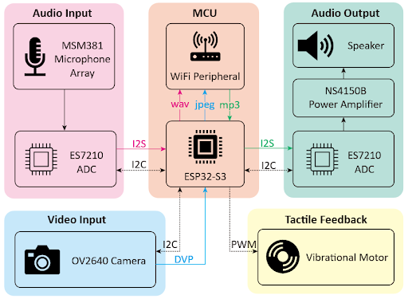
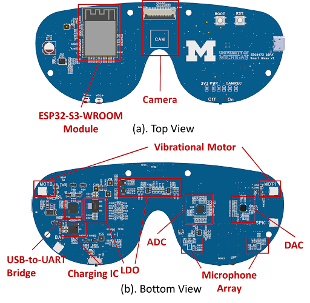

# INSIGHT: ESP32-S3-based Multimodal SoftAP PCB

**Maintainer:** Haobo Fang  
**Contact:** fanghb@umich.edu

Custom PCB board based on **ESP32-S3-WROOM-1-N8R8** serves as the real-time multimodal edge I/O hub for **INSIGHT**, working with a **Jetson Nano** to enable **real-time navigation**, **on-device scene understanding**, and **voice-based interaction with AI**. 
The ESP32-S3 establishes a bidirectional link to Jetson over **Local Wi-Fi SoftAP**: uplink (**video + wake-word audio**) / downlink (**reverse-audio + haptic feedback**).
For technical details, please scroll down. For demos, please visit [my personal website](https://realfanghb.github.io/).

## Key Features
- **FreeRTOS-based concurrency**: dedicated tasks for camera streaming, WakeNet, audio playback, haptic PWM, and key handling (real-time responsive I/O)
- **SoftAP server** with multiple TCP services (no router required and **Jetson Nano client uses multi-threading** to handle uplink/downlink streams simultaneously)
- **WakeNet** keyword spotting (“Hi ESP”) → **5s PCM** recording sent over TCP
- **OV2640 DVP camera → JPEG frames** streamed over TCP
- **Reverse audio**: receive **MP3 bytes** over TCP, buffer in PSRAM, decode & play via I2S codec
- **Haptic control**: receive intensity command over TCP → PWM for vibrators
- **Volume keys** adjust codec volume

---

## System Block Diagram


## PCB Layout Diagram


---

## 1. What it does

When `app_main()` runs (Entrypoint: `main/main.c`):

1) Initialize the system
2) Start Wi-Fi **SoftAP**  
3) Initialize **OV2640 camera** (JPEG frames)  
4) Start **WakeNet** (wake word detection)  
5) Start **Video streaming server** on port **2000**  
6) Start **Reverse audio server** (MP3 receive + playback) on port **3000**  
7) Start **Haptic feedback server** on port **4000**  
8) Start **Key listener** for volume up/down  

---

## 2. Network (SoftAP) settings

The device starts as an AP:

- **SSID**: `fanghb`  
- **Password**: `eecs473_15`  
- **Channel**: `6`  
- **Gateway IP**: `192.168.4.1`  
- **Max clients**: `4`

---

## 3. TCP ports / protocols

### (A) Video stream — `TCP :2000`
- Each frame is sent as:
  1) **4 bytes big-endian uint32**: JPEG length `N`
  2) **N bytes**: JPEG payload

Notes:
- Uses `esp_camera_fb_get()` and sends latest JPEG frames continuously.
- Server logs approximate FPS.

### (B) WakeNet recording upload — `TCP :1000`
- Trigger: say wake word **“Hi ESP”** (after an initial ~3s guard window)
- On wake:
  - records **~5 seconds** of **16 kHz / 16-bit / mono PCM**
  - starts a TCP server on port `1000`
  - when a client connects within ~10s, it sends:
    1) **4 bytes big-endian uint32**: PCM length `N`
    2) **N bytes**: raw PCM data

### (C) Reverse audio playback — `TCP :3000`
- A client pushes an **MP3 byte stream** to the device.
- The device buffers the file in PSRAM (up to ~1MB by default), then plays it using an ESP-ADF pipeline (MP3 decoder → I2S writer).

### (D) Haptic feedback — `TCP :4000`
- The device expects repeating **6 ASCII digits** per command:
  - first 3 digits = **Left** intensity (`000`–`999`)
  - next 3 digits = **Right** intensity (`000`–`999`)
- Example payload: `120450` → L=120, R=450
- It maps `0..999` to PWM duty `0..1023` (10-bit) and drives:
  - Left PWM GPIO: **IO4**
  - Right PWM GPIO: **IO7**
  - PWM freq: ~**5 kHz** (LEDC)

### (E) Volume keys
- Uses board key input events (touch/button/ADC button depending on board mapping).
- Each press adjusts volume by ±10%.

---

## 4. Hardware assumptions

This project assumes an ESP32-S3 audio/camera capable dev board, an **OV2640 DVP camera**, a **rechargable LiPo battery** and two **vibrators**.

Camera pin mapping is defined in `main/ov2640_init.c`.  
Current config notes:
- Pixel format: **JPEG**
- Default framesize set in code: **QVGA**
- XCLK set to **10 MHz** in code

---

## 5. Build & flash

### Using Espressif IDE
Open the project → select target ESP32-S3 → build → flash → monitor.

### Using CLI (ESP-IDF)
```bash
idf.py set-target esp32s3
idf.py menuconfig
idf.py build flash monitor
